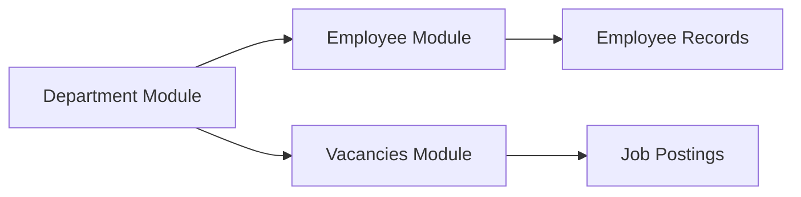

## Overview

The Department Management module provides a simple interface to create, view, edit, and delete organizational departments. Departments are used throughout the system to categorize employees and job vacancies.

<Info>
Departments created here are automatically available in the employee and vacancy modules as dropdown options.
</Info>

## Key Features

<CardGroup cols={2}>
  <Card title="Department Registry" icon="sitemap">
    Maintain a centralized list of all organizational departments.
  </Card>
  <Card title="Quick Creation" icon="plus">
    Add new departments with a simple form requiring only a name.
  </Card>
  <Card title="Edit Capabilities" icon="pen">
    Update department names as your organization evolves.
  </Card>
  <Card title="Timestamp Tracking" icon="clock">
    Automatic recording of creation dates for audit purposes.
  </Card>
</CardGroup>

## CRUD Operations

### Create New Department

<Steps>
  <Step title="Open the New Department Modal">
    Click the **"Añadir nuevo"** button in the top-right corner of the departments page.
  </Step>
  
  <Step title="Enter Department Name">
    Fill in the **"Nombre del departamento"** field. This is the only required field.
    
    Examples:
    - Recursos Humanos
    - Tecnología
    - Ventas
    - Operaciones
    - Administración
  </Step>
  
  <Step title="Submit the Form">
    Click **"Crear Departamento"** to add the new department to the system.
  </Step>
</Steps>

<Note>
The system automatically generates a unique ID and records the creation timestamp when a new department is created.
</Note>

### Read/View Departments

The departments table displays:
- **ID** - Unique department identifier
- **Nombre** - Department name
- **Creado** - Creation date (format: Y-m-d)
- **Acciones** - Edit and delete action buttons

<Accordion title="Pagination Support">
  The department list supports pagination with configurable rows per page (default: 10 departments per page). Navigate using the pagination controls at the bottom of the table.
</Accordion>

### Update Department

<Steps>
  <Step title="Click the Edit Button">
    In the departments table, click the edit icon (pen) in the Actions column for the department you want to modify.
  </Step>
  
  <Step title="Change the Department Name">
    Update the name in the **"Nombre del departamento"** field.
  </Step>
  
  <Step title="Save Changes">
    Click **"Guardar Cambios"** to update the department. The form submits to `functions/editarDepartamento.php`.
  </Step>
</Steps>

<Warning>
Changing a department name will affect all employees and vacancies associated with that department.
</Warning>

### Delete Department

Click the delete icon (trash) in the Actions column for any department. A confirmation prompt will appear before the department is permanently removed.

<Warning>
**Important Considerations Before Deleting:**
- Ensure no employees are currently assigned to this department
- Verify no active job vacancies reference this department
- Deletion is permanent and cannot be undone
</Warning>

## Form Fields and Validation

| Field Name | Type | Required | Validation | Database Column |
|------------|------|----------|------------|----------------|
| `nombre` | Text | Yes | Non-empty string | `nombre` |
| `created_at` | Timestamp | Auto | System-generated | `created_at` |

### Validation Rules

```php
// Server-side validation
if ($nombre === '') {
    die("❌ Nombre requerido");
}
```

The department name cannot be empty. All other validations are handled at the database level.

## Data Structure

### Database Table: `departamento`

```json
{
  "id": "auto-incremented integer",
  "nombre": "string",
  "created_at": "timestamp (Y-m-d H:i:s)"
}
```

### Example Record

```json
{
  "id": 5,
  "nombre": "Recursos Humanos",
  "created_at": "2024-03-15 10:30:00"
}
```

## Role-Based Access

<Info>
Access to the Department Management module requires an active session with a valid authentication token. Users without a valid `$_SESSION['token']` will be redirected to the login page.
</Info>

### Required Permissions
- **View Departments** - Authenticated users
- **Create Department** - Users with write permissions
- **Edit Department** - Users with write permissions
- **Delete Department** - Users with delete permissions (use with caution)

## Integration with Other Modules

Departments are referenced in:

<CardGroup cols={2}>
  <Card title="Employee Management" icon="users">
    Employees are assigned to departments via the department dropdown selector.
  </Card>
  <Card title="Job Vacancies" icon="briefcase">
    Job postings specify which department the position belongs to.
  </Card>
</CardGroup>

### Department Data Flow



## Technical Details

### API Endpoints

- **GET** `/departamento?select=*&order=created_at.desc&limit={perPage}&offset={offset}` - Fetch paginated departments
- **GET** `/departamento?select=id` - Get total count for pagination
- **GET** `/departamento?select=nombre` - Get department names for dropdowns (used in other modules)
- **POST** `/departamento` - Create new department (uses `supabase_request_service` with service role)
- **POST** `/functions/editarDepartamento.php` - Update department

### JavaScript Files

- `main.js` - Core CMS functionality and alert handling
- `maindepartamentos.js` - Department-specific interactions (edit modal, delete confirmation)

## User Workflows

### Setting Up Organizational Structure

<Steps>
  <Step title="Plan Your Departments">
    List all organizational units in your company (HR, IT, Sales, Operations, etc.).
  </Step>
  
  <Step title="Create Each Department">
    Use the "Añadir nuevo" button to create each department one by one.
  </Step>
  
  <Step title="Verify the List">
    Review the departments table to ensure all units are properly created.
  </Step>
  
  <Step title="Proceed to Employee Setup">
    Once departments are created, you can begin adding employees and assigning them to their respective departments.
  </Step>
</Steps>

### Reorganizing Department Names

<Steps>
  <Step title="Review Current Structure">
    Check the departments table for any names that need updating due to organizational changes.
  </Step>
  
  <Step title="Edit Department Names">
    Click the edit icon for each department that needs to be renamed.
  </Step>
  
  <Step title="Verify Impact">
    Remember that changing a department name will update it everywhere it's referenced (employee profiles, job postings).
  </Step>
</Steps>

## Best Practices

<CardGroup cols={2}>
  <Card title="Naming Conventions" icon="tag">
    Use clear, consistent department names (e.g., "Recursos Humanos" not "RH" or "rrhh").
  </Card>
  <Card title="Before Deleting" icon="exclamation-triangle">
    Always check employee and vacancy associations before deleting a department.
  </Card>
  <Card title="Organizational Alignment" icon="sitemap">
    Keep department structure aligned with your actual organizational chart.
  </Card>
  <Card title="Regular Review" icon="sync">
    Periodically review and update department names as your organization evolves.
  </Card>
</CardGroup>

## Flash Messages

The system provides feedback through flash messages:

<Accordion title="Success Messages">
  - **✅ Departamento creado** - Department successfully created
  - Success messages appear in green alerts and auto-dismiss
</Accordion>

<Accordion title="Error Messages">
  - **❌ Nombre requerido** - Department name field is empty
  - **❌ Error al crear departamento: {details}** - Database or API error occurred
  - Error messages appear in red alerts
</Accordion>
